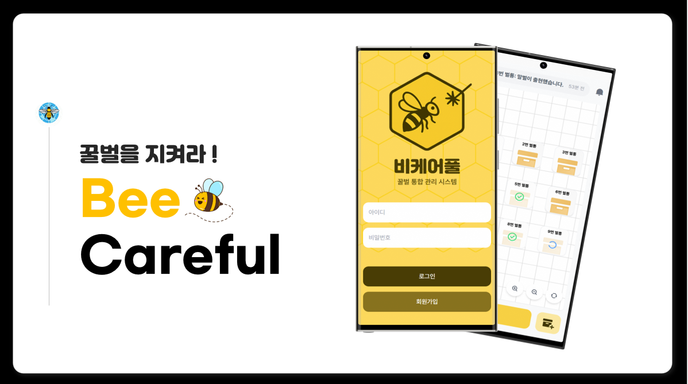
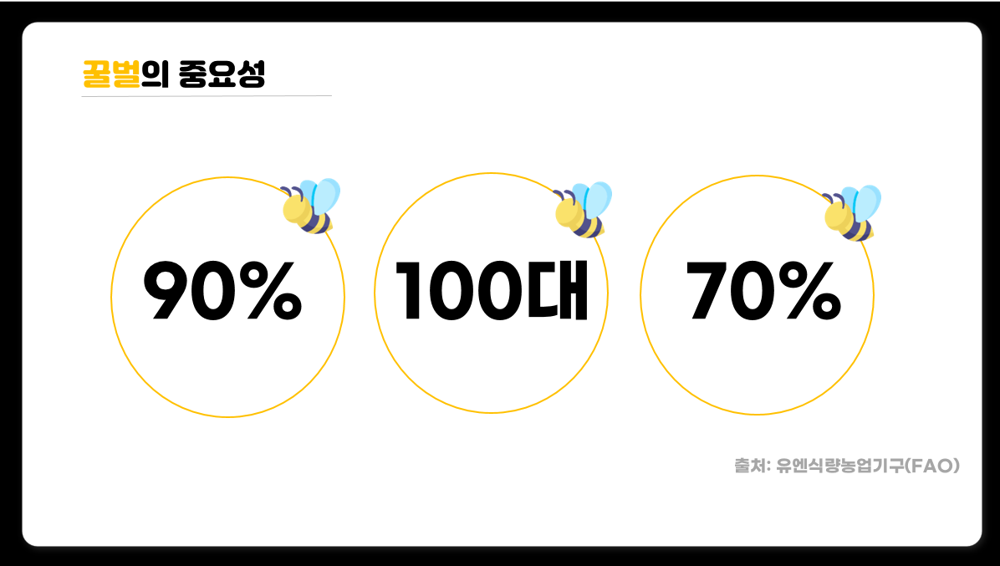
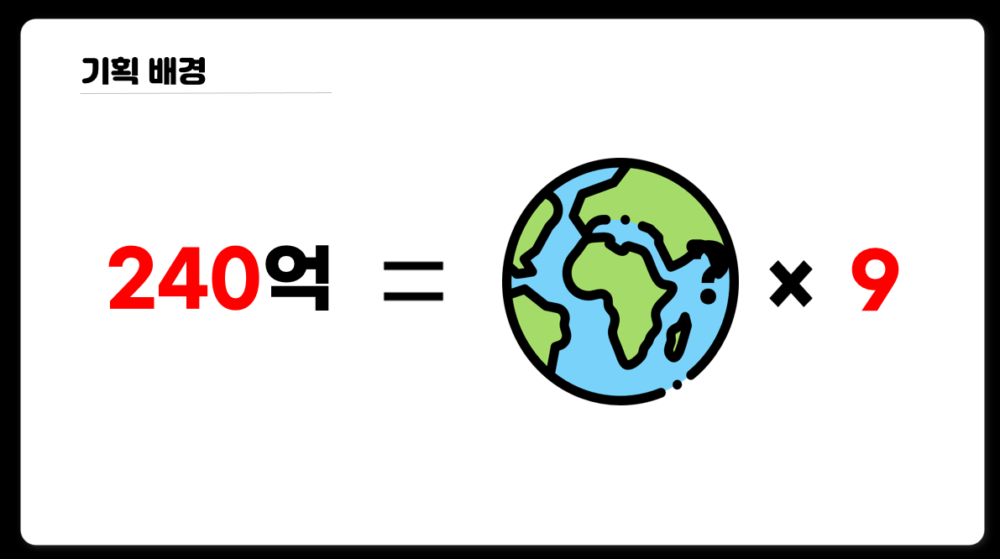
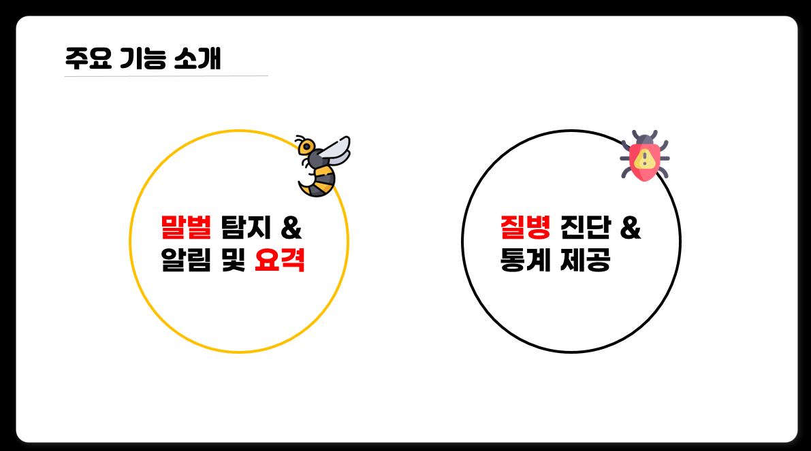
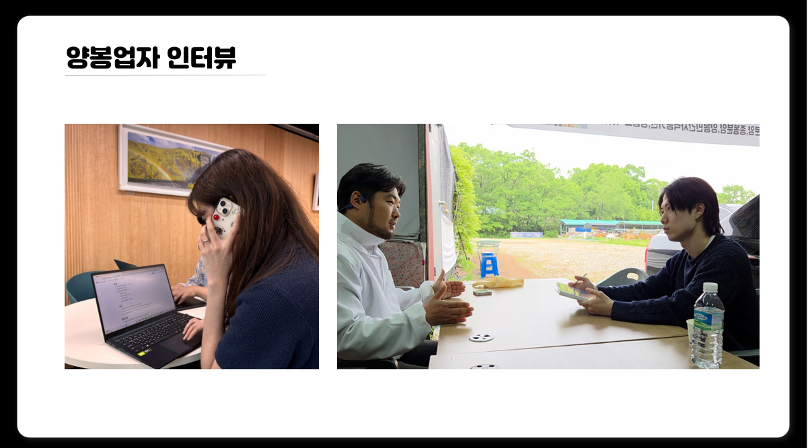
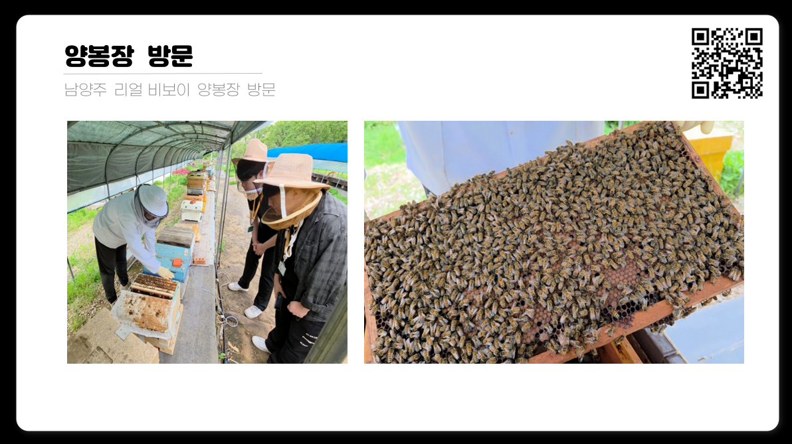
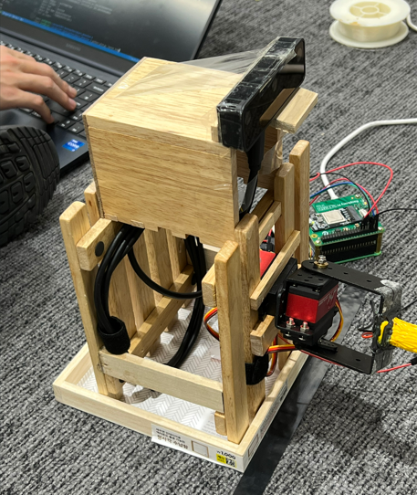
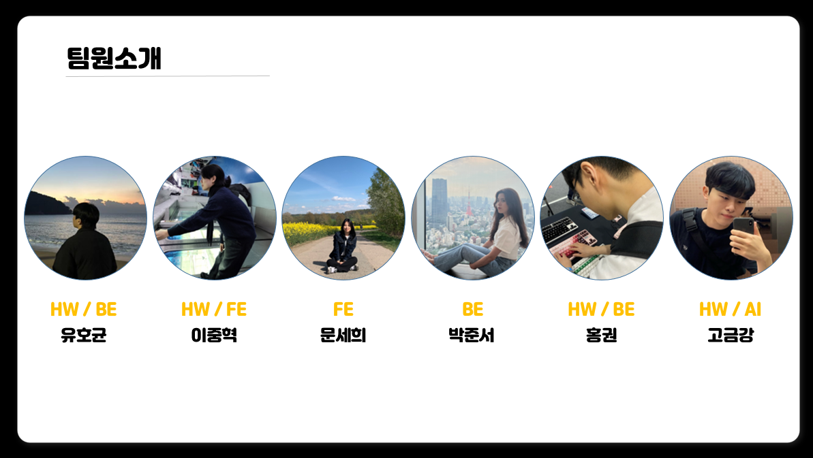

## 🌸 기획 배경

**"꿀벌이 멸종하면 인류는 4년안에 멸종한다."**  -아인슈타인

### 🐝 세계 식량의 90%를 차지하는 100대 농작물 중에, 약 70%가 꿀벌의 수분활동에 의존한다.
### 🐝 전세계적인 식량 안보에 아주 큰 영향을 끼치는 것을 알 수 있다. 

### 🐝 그런데, 이렇게 중요한 꿀벌이 전 세계에 동시다발적으로 사라지고 있다.
### 🐝 2023년 국내의 꿀벌이 약 230억 마리가 폐사했다. 이는 꿀벌의 평균 길이가 약 1.5cm 라고 했을때 지구를 9바퀴를 감쌀 수 있다고 한다. 

## 🌸 기능

## 🌸 우리들의 노력

## 🌸 Turret

## 🌸 팀원소개 

## 🌸 VLOG
### 🐝대전 인터뷰 편
https://www.youtube.com/watch?v=CoOrLEPbLMc

### 🐝리얼 비보이 양봉장편
https://www.youtube.com/watch?v=XXuzO9F31E8
