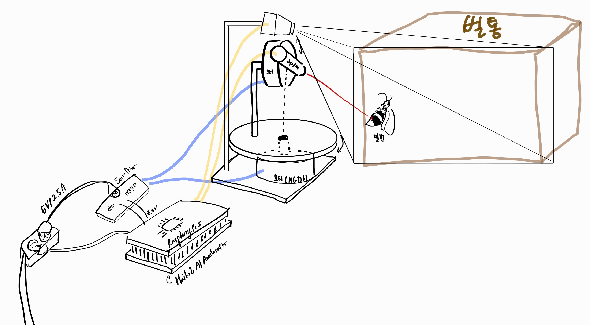
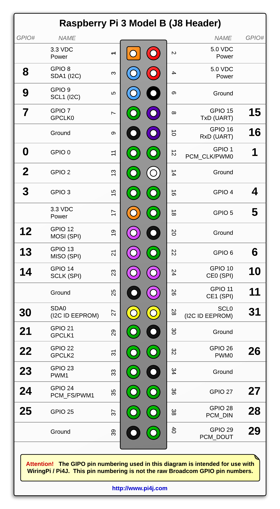
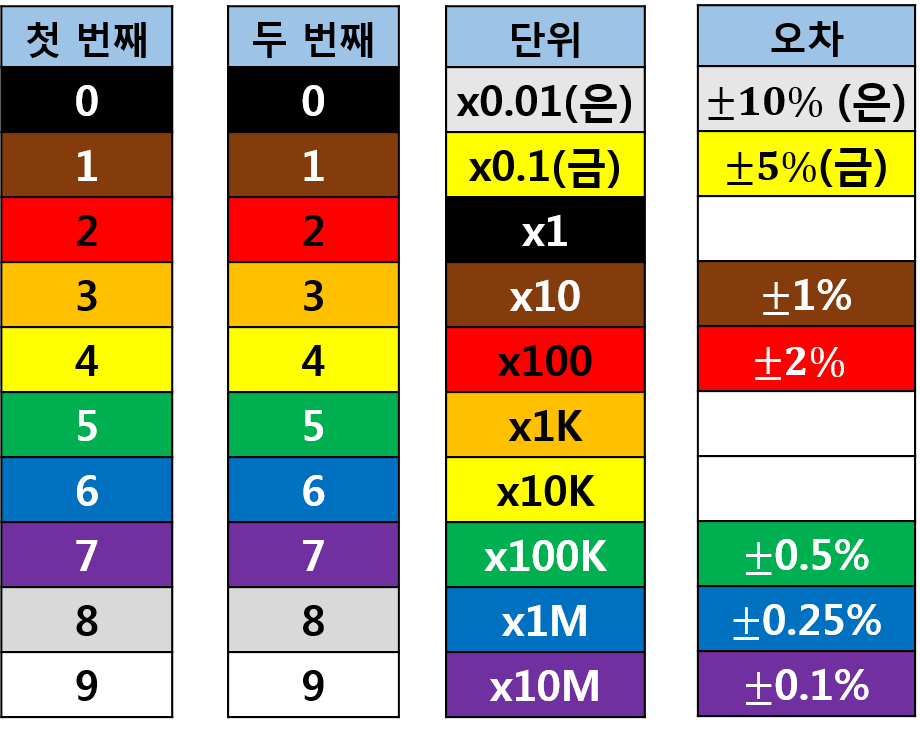
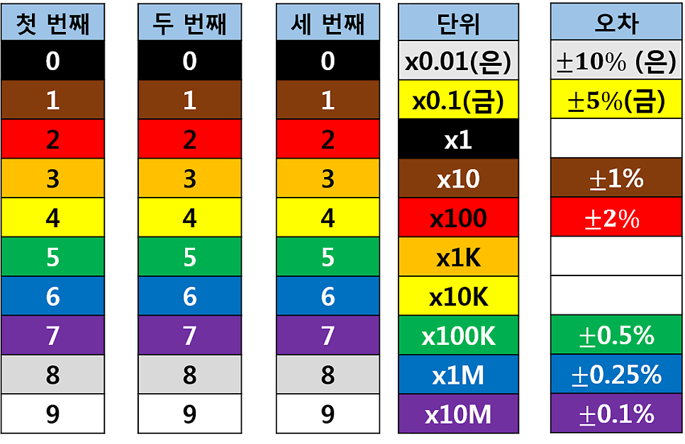
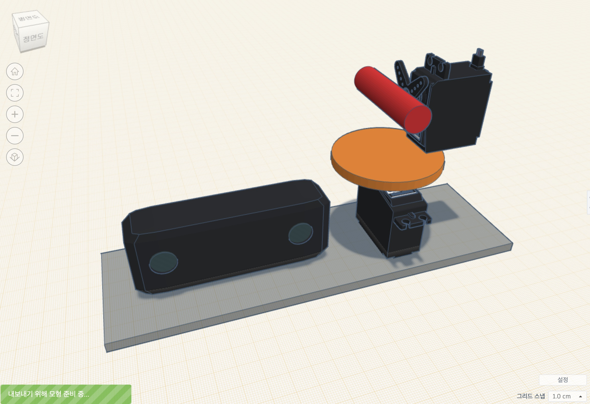

2025_04_22(화)

<ol>
  <li>'Bee Careful' 기능 구체화</li>
  <li>양봉장 꿀벌 수 실태</li>
  <li>양봉업 프로세스</li>
  <li>양봉업 고충</li>
  <li>해외 레퍼런스</li>
</ol>

2025_04_23(수)

<ol>
  <li>양봉장 피해</li>
  <li>양봉장 말벌 피해</li>
  <li>말벌 요격 기능 구체화</li>
  <li>말벌 요격 기능 설계</li>
  <li>젯슨 나노, 라즈베리파이 등 하드웨어 스펙</li>
</ol>

2025_04_24(목)

<ol>
  
일정관리 방법

  <ol>
    <li>아이젠하워</li>
    <li>만트라트</li>
    <li>뽀모도로</li>
    <li>타임박싱</li>
    <li>타임블럭</li>
    <li>focus time</li>
    <li>PARA</li>
    <li>제텔카스텐</li>
  </ol>
  

    하드웨어 조사
  

  <ol>
    <li>
      PMW/서보 드라이버: 별도 전원이 필요함 (5 ~ 6V)
    </li>
    <li>서보모터 스펙</li>
    <li>
      전류와 전압 개념
      
        <ul>
          <li>전류(A): 전기의 흐름의 양 (파이프에 흐르는 물의 양으로 비유)</li>
          <li>전압(V): 전류의 압력 (수압으로 비유)</li>
          <li>전력(W): 전류 x 전압</li>
          <li>
            전압이나 전류가 시스템의 기대보다 과할 경우
            시스템이 손상될 수 있음.
          </li>
        </ul>
      
    </li>
  </ol>
  
말벌 퇴치장치 구체화

  <li>구상도
  
  </li>
</ol>

2025_04_25(금)

<ol>
  
소프트 스킬

  <ol>
    <li>말 다듬어서 하기: 내가 안다고 생략하지 않기 (특히 기획 단계에서 서로 생각하는 것이 다를 수 있음)</li>
    <li>겸손하게 말하기: 배우는 사람으로서, 당신과 함께 프로젝트를 성공으로 이끌어내고 싶은 사람으로서 말하기</li>
    <li>표정 펴기</li>
    <li>역할 분배: 기여하고자 하는 사람 입장도 고려하기</li>
  </ol>
  
  
클라이언트 테스트

  <ol>
    <li>유닛 테스트(Visual/Logic), E2E 테스트</li>
    <li>Jest vs Vitest</li>
    <li>Cypress</li>
  </ol>
</ol>

2025_04_26(토)

<ol>
  
대규모 분산 처리 시스템

  <ol>
    <li>CV 기반 꿀벌 질병 추론이 클라우드에서 진행됨.</li>
    <li>유저가 늘어날 경우 분산 처리 시스템을 구축하기 위한 아키텍처 설계 필요</li>
  </ol>

2025_04_27(일)

<ol>
  
아파치 카프카

  <ol>
    <li>이벤트 데이터 스트림 분산 처리 플랫폼</li>
    <li>ex, 클라이언트 냉장고 온도 데이터 처리</li>
    <li>Message Broker에서 Topic과 파티션으로 나뉘고, 메시지를 디스크에 처리</li>
    <li>Producer가 제공, Consumer가 소비 (smart consumer)</li>
    <li>클러스터링을 통해 fault tolerance(내결함성) 보장</li>
  </ol>
  
아파치 하둡

  <ol>
    <li>빅 데이터 배치 처리 시스템</li>
    <li>ex, 하루치 로그 처리</li>
  </ol>

2025_04_28(월)

<ol>
  
팩트 폭행

  <ol>
    <li>팩트는 팩트인가?</li>
    <li>불필요한 말</li>
    <li>팩트는 아파야 하는가?</li>
    <li>I-statement</li>
    <li>공통의 목표 환기하기</li>
    <li>상대방의 입장을 한 번 헤아리고 내 입장 말하기</li>
    <li>
      
버려야할 것

      <ol>
        <li>사무적/기계적으로 말하는 것</li>
        <li>타인의 감정을 배려한 말투를 쓰자. 실제로 유의미한 가치이고, 신경써야한다.</li>
        <li>지난 경험으로 비관하기</li>
        <li>거들먹, 빈정거림</li>
        <li>수동적 공격성 (Passive Aggression)</li>
        <li>-> 재치있고 기가 센 것이 아닌 무례한 것, 투명하게 소통하지 못하는 것이다.</li>
        <li>염세주의. 인생에 도움이 되지 않는다!</li>
      </ol>
    </li>
  </ol>
  
라즈베리파이 GPIO (General-purpose input/output)

  <ol>
    <li>
    
GND(Ground) pin: 전류 흐름에 대한 복귀 경로를 제공하여 전기 회로를 완성한다.

    라즈베리파이 3B GPIO 맵
    </li>
    </li>
  </ol>

2025_04_29(화)

<ol>
  <li>
    
라즈베리 파이 전원

    <ol>
      <li>Raspberry PI 4 : 5V 3A</li>
      <li>Raspberry PI 3 : 5V 2.5A</li>
      <li>건전지 직류 홀더 활용 가능</li>
    </ol>
  </li>
  <li>
    
서보모터 컨트롤러 PCA9685

    <ol>
      <li>SCL(Serial Clock) : I2C 통신을 위한 클럭 신호선</li>
      <li>SDA(Serial Data) : I2C 통신을 위한 데이터 신호선</li>
      <li>VCC(max 5V), V+(max 6V)</li>
      <li>16개 채널의 PWM로 구성</li>
    </ol>
  </li>
  <li>
    
저항 읽는 법

    띠가 4개일 경우
    
    띠가 5개일 경우
    
  </li>
</ol>

2025_04_30(수)

  <ol>
    <li>
    
면접은 소개팅이다.

    <ol>
      <li>서로 알아가는 자리.</li>
      <li>궁금한 건 물어보고, 스마트하게 어필하기.</li>
    </ol>
  </li>
  <li>
    
PWM (Pulse Width Modulation)

    
현재 모터의 정밀 제어가 필요함.

    <ol>
      <li>모터의 속도 (RPM) 제어 방식 중 하나</li>
      <li>신호를 주는 시간을 Pulse 단위로 제어하여(시간 비례 제어 방식 Time Proportional Control) 전압을 조절하는 방식</li>
      <li>Duty Cycle: 한 Pulse에서 ON신호의 비율</li>
      <li>평균 전압 = 입력 전압 x Duty Cycle</li>
      <li>ex) 10V의 전압으로 Duty Cycle 50%으로 설정하여 PWM 제어를 통한다면 5V의 평균 전압을 가진다.</li>
      <li>이외에 저항으로 제어할 수 있으나, 열 에너지 등으로 에너지 손실이 발생함.</li>
    </ol>
    
PID (Proportional Integral Derivative)

    <ol>
      <li>PWM을 이용해 원하는 출력으로 맞춰놓았더라도, 무게가 추가되거나 입력 전압이 떨어지는 등의 변수가 있음</li>
      <li>PID 제어는 현재 상태와 목표 상태의 차이를 줄이기 위한 제어 방식</li>
      

        

          현재 상태는 어떻게 측정할까?
        

        

          <h3>✅ 대표적인 측정 방법</h3>
          - 제어 대상 -	측정할 항목 -	사용하는 센서/방법    
          - DC 모터 -	속도 -	엔코더 (rotary encoder), 홀 센서  
          - 로봇 팔 -	각도, 위치 - 포텐셔미터, 엔코더, IMU  
          - 드론 - 자세(기울기 등) - IMU (자이로 + 가속도계)  
          - 온도 제어기 - 온도 - 써미스터(thermistor), 서미스터(thermocouple)  
          - 거리/위치 - 거리 - 초음파 센서, IR 센서, LIDAR  
          - 전류/전압 제어 - 전류, 전압 - 전류 센서(Hall effect sensor), 분압회로
        

      

      <li>PID 제어는 Proportional, Integral, Derivative의 세 가지 요소로 구성됨</li>
      <li>Proportional: 현재 상태와 목표 상태의 차이를 비례적으로 줄임</li>
      <li>Integral: 과거의 오차를 누적하여 보정함</li>
      <li>Derivative: 오차의 변화 속도를 이용해 반응을 조절함 (예: 진동 억제)</li>
    </ol>
  </li>
  <li>
    
심도 카메라를 활용한 터렛 각도 제어

    <ol>
      <li>심도 카메라와 객체 탐지 모델의 리턴값으로 객체의 x, y, z 좌표가 가능함. (https://docs.luxonis.com/hardware/platform/features/depth/)</li>
      <li>심도 카메라와 터렛의 물리적 거리가 존재할 수 밖에 없음</li>
      <li>그 차이(x, y, z)를 고정하고, 심도 카메라에서 가져온 말벌의 좌표에 더해 레이저로부터의 말벌 상대 좌표 계산</li>
      <li>피타고라스와 삼각함수를 이용해 각 Pan과 Tilt 각도 계산</li>
    </ol>
  </li>
  </ol>

2025_05_01(목)

<ol>
  
브라우저의 웹 페이지 랜더링 과정

  
CRP (Critical Rendering Path)

  <ol>
    <li>
      
HTML

      <ol>
        <li>HTML token</li>
        <li>Node</li>
      </ol>
    </li>
    <li>DOM (Document Object Model)</li>
    <li>CSSOM (CSS Object Model)</li>
    <li>Render Tree (DOM + CSSOM)</li>
    <li>
      
Layout

      <ol>
        <li>Block element</li>
        <li>viewport</li>
      </ol>
    </li>
    <li>Paint</li>
    <li>
      
페이지를 최적화하려면

      <ol>
        <li>측정하라!</li>
        <li>큰 데이터 미루기(defer, async)</li>
        <li>요청, 응답 데이터 크기 최소화</li>
        <li>우선순위에 따라 핵심 요소를 먼저 제공하기</li>
      </ol>
    </li>
  </ol>
</ol>

2025_05_02(금)

<ol>
  
데일리컨텐츠

  <ol>
    <li>SOLID</li>
    <li>Overengineering</li>
    <li>DRY (Don't Repeat Yourself)</li>
    <li>KISS (Keep it simple stupid)</li>
    <li>YAGNI (You ain't gonna need it)</li>
  </ol>
  
전자 회로 설계 시 위험 요소 (주의할점)

  <ol>
    <li>
      
SMPS(Switching Mode Power Supply)

      
높은 전력 입출력으로 주의를 요함.

      
스텝 다운 컨버터 (전압강하모듈)는 허용 입력을 실제 입력의 두 배 잡고 설계해야 함. (입력이 튈 수 있음)

      
과전류 시 축전기가 터질 수 있음.

      
항상 접지를 연결할 것

      
차단기가 달린 멀티탭을 사용할 것

    </li>
    <li>
      
접지의 목적

      
인체 감전 방지: 접지를 통해 전기 기기 외함이나 금속성 부품에 누전이 발생했을 때, 누설 전류가 대지로 빠져나가도록 하여 인체가 감전되는 것을 예방 

      
기기 손상 방지: 접지는 전기 기기의 절연이 파괴되어 외부 금속 부분에 전류가 흐르는 지락 사고 발생 시, 누설 전류를 대지로 방출하여 기기의 손상을 막음 

      
보호계전기의 확실한 동작 확보: 지락 사고 발생 시 보호계전기를 통해 전력 시스템을 차단할 수 있게 함 

      
*보호계전기: 전력 시스템에 사고가 발생했을 때 이를 감지하고 신속하게 고장 부분을 차단하여 시스템의 안전을 유지하는 장치

    </li>
  </ol>
  
케이블 규격

  <ol>
    <li>
      
USB 2.0

      
데이터 전송률(480Mbps), 전원 공급(최대 500mA)

    </li>
    <li>
      
USB 3.0

      
데이터 전송률(4.8Gbps), 전원 공급(최대 900mA)

    </li>
  </ol>
  
라즈베리파이 협업

  <ol>
    <li>
      
VLAN 기반 원격 SSH 설정

      
가상사설망을 제공하는 Tailscale 서비스 사용

      
프로젝트용 google id로 접속하고자 하는 기기의 IP를 등록하면 이미 등록된 IP들에 SSH 접속할 수 있음

    </li>
    <li>
      
USB 3.0

      
데이터 전송률(4.8Gbps), 전원 공급(최대 900mA)

    </li>
  </ol>
  
라즈베리파이 헤드리스 SSH 연결

  <ol>
    <li>헤드리스 SSH 연결: 라즈베리파이에서는 부팅만 하고, 모든 설정을 개발 PC에서 할 수 있음. 따라서 추가적인 IO 장치(모니터, 키보드)가 필요 없음</li>
    <li>Raspberry PI OS를 설치할 때, hostname, 초기 wifi, ssh 허용을 설정</li>
    <li>라즈베리파이에 OS가 설치된 SD 카드를 삽입하고 전원 연결</li>
    <li>부팅 시간 대기 (약 3분)</li>
    <li>같은 wifi에 연결된 pc로 hostname을 통해 ssh 접속</li>
    <li>AP에 따라 DNS에 hostname이 등록되지 않을 수 있으므로 실패 시 ip로 ssh 연결</li>
    <li>라즈베리파이의 IP는 AP 관리자로 접속하면 확인 가능함</li>
  </ol>
</ol>

2025_05_05(월)

<ol>
  
양봉장 답사

  <ol>
    <li>
      해당 양봉장에는 말벌 피해가 없다 싶을 정도로 말벌 유인책이 효과적으로 작용하고 있다.
    </li>
    <li>대신 유인한 말벌을 죽이는 작업이 필요함</li>
    <li>질병 탐지 관련해서는 응애 문제가 가장 유효할 것이다. 다른 질병은 탐지해도 할 수 있는 것이 없고, 응애에서 파생되는 질병이기 때문</li>
    <li>실제로 1년에 수 차례(시기에 맞게) 각 벌통의 300마리 꿀벌을 표본으로 응애 검사를 진행한다.</li>
    <li>응애 검사 과정은, 채집한 300마리의 꿀벌에 슈가파우더를 뿌리고 꿀벌이 이를 청소하면서 나온 응애의 개수를 센다.</li>
    <li>꿀벌 300마리에서 나온 응애가 9마리(3%)를 넘는다면 방역 조치를 취한다.</li>
    <li>분봉 문제도 존재했다. 분봉 시기를 놓친다면 해당 벌통의 50%의 꿀벌을 잃게 되어 재산상 피해가 발생한다. -> 분봉열 탐지로 도울 수 있을 것. -> 온도 센서로 탐지 후 알림</li>
    <li>교육 문제도 존재했다. 국내에서 양질의 양봉업 정보를 얻기 힘들다는 것. 답사했던 양봉장은 사장님께서 영문학과를 전공했고 젊은 분이셨기에 해외 자료를 많이 참고한다고 하시지만, 이외 대부분의 양봉장에서는 정보 습득이 어려운 상황이라고 한다. -> RAG 기반 챗봇 가능</li>
    <li>말벌 퇴치기의 문제 - 가격이 너무 비싸다. -> 벌통 당 하나가 아닌 양봉장 공용 퇴치기로 개선할 여지가 있다.</li>
  </ol>
</ol>

2025_05_07(수)

<ol>
  

  <ol>
    <li>
      목업 제작, 회로 연결
    </li>
    <li>
      두 전선 연결하기  
      - 피복 제거   
      - 전선 a를 전선 b에 감싸기 (돌돌 말기)  
      - 전선 b의 마지막 꼬투리를 안으로 말아 전선을 양쪽으로 당겨도 빠지지 않도록 하기  
      - 절연 테이프 감기  
    </li>
    <li>
      3D펜 목업 제작. 정밀 제어가 필요한 부품 주문 (브라켓)
    </li>
  </ol>
</ol>

2025_05_08(목)

<ol>
  
모터 정밀 제어

  <ol>
    <li>
      PCA9685 모듈을 통해 PWM 신호를 생성하여 서보모터를 제어함.
    </li>
    <li>
      서보모터에서 수신하는 Pulse Width Range에 맞게 설정: 
      servo.set_pulse_width_range(_min, _max)
    </li>
    <li>
      서보모터에서 수신하는 Frequency에 맞게 PCA9685 모듈을 설정:
      pca.frequency = 330
    </li>
  </ol>
  
터렛 조준 로직

  <ol>
    <li>객체탐지모델로부터 객체의 x, y, z 좌표(mm)를 받음. (카메라 기준).</li>
    <li>터렛 중심축과 객체의 상대 좌표를 구함.</li>
    <li>구면좌표계를 이용하여 두 축의 각도를 계산.</li>
    <li>레이저 on/off는 라즈베리5용 gpio 라이브러리 gpiozero를 이용(python)</li>
  </ol>
</ol>

2025_05_09(금)

<ol>
  
임베디드

  <ol>
    <li>
      
구조를 구현할 방안을 간과하고 있었다.

      
자재, 도구가 부족했다.

      
추가로 기존 구조는 수정이 필요했고, 케이스 제작을 생각하지 않고 있었다.

      
- 기존 구조

      
      
-> 이미지 왜곡을 최소화하기 위해, 카메라와 터렛을 가로로 배치하지 않고 세로로 배치하기로 했으며, 이를 지지하고 보호할 케이스를 제작하기로 했다.

    </li>
  </ol>
  
프론트엔드

  <ol>
    <li>
      
패키지 정의서

      
패키지 정의서를 작성하고 개발을 시작하니 좀 더 상세한 설계 및 컨벤션 정의가 가능했다.

      
개발해보니 패키지 정의서에 정의된 파일 외에도, 추가적으로 필요한 파일이나 필요 없는 파일도 있었다.

    </li>
    <li>
      
RemixIcon

      
패키지에서 제공하는 태그 외에도, 동적 아이콘 사용(prop을 통한 전달 등)을 위해서 CDN이 필요하다고 생각했지만 아니었다.

      
생각해보니 remixicon 패키지에 아이콘들이 정의되어있고, 이를 node_modules에 가지고 있으니 이를 사용하면 됐다.

      
사전 정의된 CSS를 import하는 방법을 사용할 수 있었고, webpack과 vite의 문법이 달랐다.

      
vite:  
      <code>@import 'remixicon/fonts/remixicon.css';</code>

      
webpack:  
      <code>@import '~remixicon/fonts/remixicon.css';</code>

    </li>
    <li>
      
eslint (eslint.config.js)

      
다른 프론트엔드 팀원과 협업하면서 많은 걸 배우고 있다.

      
React 컴포넌트, 커스텀훅, 인터페이스, 함수, 변수 등의 네이밍 룰 정의가 가능하다. (format, suffix, etc)

      
Typescript의 타입에 대한 룰 정의가 가능하다.

      
다양한 경고 및 주석 스타일 정의도 가능하다.

    </li>
    <li>
      
prettier (.prettierrc)

      
tailwind 플러그인을 사용하여 className의 순서를 포맷팅 할 수 있다.

      <code>"plugins":["prettier-plugin-tailwindcss"]</code>
    </li>
    <li>
      
React

      
RouterProvider를 이용하여 라우팅 파일을 분리할 수 있다.

      <code>import { RouterProvider } from 'react-router-dom';</code>
    </li>
  </ol>
</ol>

2025_05_12(월)

<ol>
  
React hook

  
재 랜더링 시 자신의 기존 상태를 기억하며 (컴포넌트 생명주기에 따라) 작동하는 함수

  
관련 에러: Hooks can only be called inside the body of a function component.

  <ol>
    <li>
      
컴포넌트 첫 랜더링 시 컴포넌트의 모든 훅을 연결 리스트로 관리한다.

      
이후 랜더링 시 연결 리스트는 각 훅을 index로 매칭하고 순서대로 실행(업데이트)할 수 있도록 한다.

    </li>
    <li>
      따라서 훅을 실행할 때에는 몇 가지 규칙이 존재한다.
      
1. 컴포넌트의 최상위에서만 호출해야 한다.

      
2. 조건문이나 반복문 안에서 호출하면 안된다.

      
3. 일반 함수가 아닌 리액트 컴포넌트 안에서만 호출해야 한다.

      
4. 커스텀 훅은 'use'로 시작해야 한다.

    </li>
    <li>이를 쉽게 반영할 수 있는 eslint plugin이 존재한다.</li>
  </ol>
</ol>

2025_05_13(화)

<ol>
  
브라우저의 쿠키 정책

  <ol>
    <li>
      
SameSite의 기본값 = Lax: 특수 조건에만 서드파티(도메인이 다른) 쿠키를 허용함

      <li>
      
브라우저 정책상 Secure과 SameSite가 둘 다 None인 쿠키를 허용하지 않음

    </li>
    <li>
      
localhost에서 쿠키를 받아 테스트하는 환경을 구축하고자 Https 인증서를 받아(mkcert 사용) vite 번들러에 적용했다. => Secure=True & SameSite=None

    </li>
  </ol>
  
애니메이션 라이브러리 framer-motion

  <ol>
    <li>
      
애니메이션을 쉽게 구현할 수 있는 라이브러리

      
React와 함께 사용하기 좋음

      
단순 js, CSS로 구현하기 어려운 애니메이션도 가능함 (코드 양이 줄고 가독성이 좋아짐)

    </li>
    <li>
      
성능에 치명적일 수 있기에 구현하면서 layout reflow를 최소화했다.

    </li>
  </ol>
</ol>

<!-- 양식

2025_05_()

<ol>
  

  <ol>
    <li>
    </li>
  </ol>
</ol>

-->
